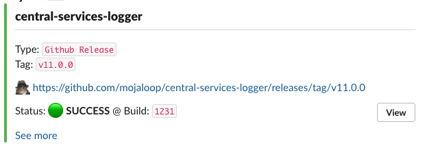
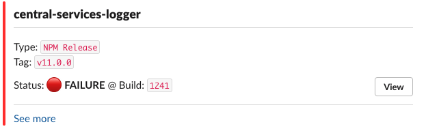

# Slack Templates

Here you will find Slack announcement & notification templates that are used in the Mojaloop CI-CD flows.

These templates are build using the [Slack Block Kit](https://app.slack.com/block-kit-builder/T88MFD99D), and are executed by the CircleCI [slack-orb](https://circleci.com/developer/orbs/orb/circleci/slack) during CI-CD flows.

Note that environment variables `SLACK_ACCESS_TOKEN` and `SLACK_DEFAULT_CHANNEL` must be set for this orb to work.

## Types

### Release

 Template | CircleCI Context Env variable | Template
---------|----------|---------
  | SLACK_TEMP_RELEASE_SUCCESS | [slack-temp-release-success.json](./slack-temp-release-success.json)
  | SLACK_TEMP_RELEASE_FAILURE | [slack-temp-release-failure.json](./slack-temp-release-failure.json)

**Slack Job Environment Configuration**:

Env-config | Description | Required (Y/N)
---------|----------|---------
 SLACK_PROJECT_NAME | Github Project Name | Y
 SLACK_RELEASE_TYPE | Release type, e.g. `GitHub Release`, `NPM Release`, `NPM Snapshot`, `Docker Release`, `Docker Snapshot` | Y
 SLACK_RELEASE_TAG | Semantic version, e.g. `v0.0.0` | Y
 SLACK_BUILD_ID | CI-CD build/build number, e.g. `1234` | Y
 SLACK_RELEASE_URL | URL to published artefact on Github, NPM or DockerHub | Y
 SLACK_CI_URL | URL to release build job | Y
 SLACK_CUSTOM_MSG | Optional custom message that supports Markdown | N

**Example**:

```yaml
  publish:
    executor: default-docker
    steps:
      - run:
          name: Install general dependencies
          command: *defaults_Dependencies
      - checkout
      - run:
          name: Setup Slack config
          command: |
            echo "export SLACK_PROJECT_NAME=${CIRCLE_PROJECT_REPONAME}" >> $BASH_ENV
            echo "export SLACK_RELEASE_TYPE='NPM Snapshot'" >> $BASH_ENV
            echo "export SLACK_RELEASE_TAG=v${CIRCLE_TAG:1}" >> $BASH_ENV
            echo "export SLACK_RELEASE_URL=https://www.npmjs.com/package/@mojaloop/${CIRCLE_PROJECT_REPONAME}/v/${CIRCLE_TAG:1}" >> $BASH_ENV
            echo "export SLACK_BUILD_ID=${CIRCLE_BUILD_NUM}" >> $BASH_ENV
            echo "export SLACK_CI_URL=${CIRCLE_BUILD_URL}" >> $BASH_ENV
      - run:
          <<: *defaults_npm_auth
      - run:
          <<: *defaults_npm_publish_release
      - slack/notify:
          event: pass
          template: SLACK_TEMP_RELEASE_SUCCESS
      - slack/notify:
          event: fail
          template: SLACK_TEMP_RELEASE_FAILURE
```

**Notes**:

- Ensure that you place the `Setup Slack config` (see example) Run block prior to the actual deployment operations, otherwise on failures the Slack Job Environment Configuration will not be defined.
